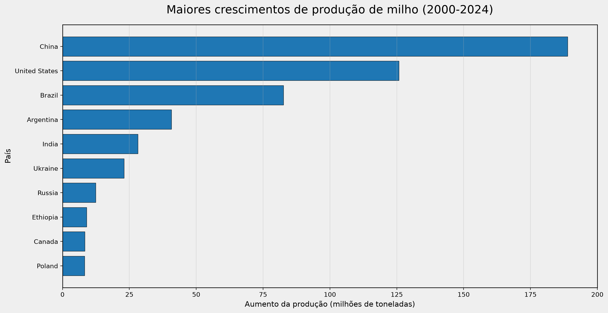
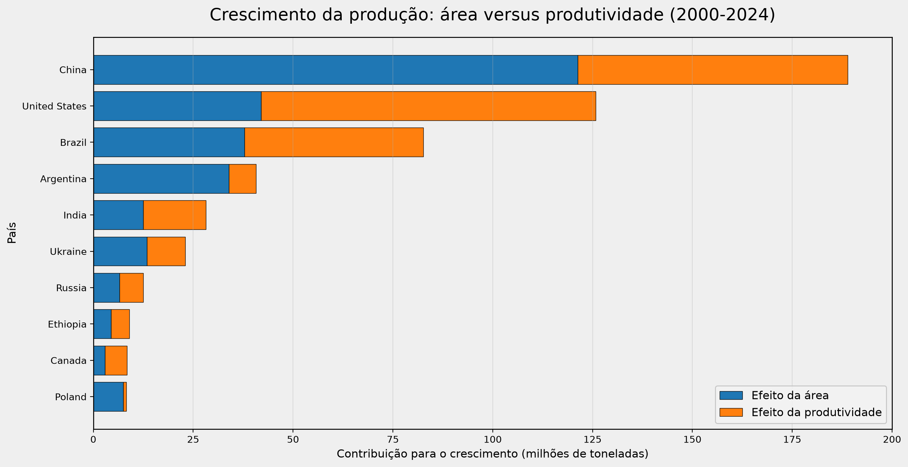

# 🌽 Análise do Mercado Global de Milho

Projeto reprodutível em Python para análise do mercado global de milho, com dados do Our World in Data e da FAO. O fluxo cobre carregamento, limpeza, cálculo de KPIs, rankings, análise de crescimento, análise de eficiência, market share, correlações e triagem de oportunidades de mercado.
---

## 📑 Sumário

- [Objetivo](#-objetivo)
- [Estrutura do projeto](#-estrutura-do-projeto)
- [Como reproduzir](#-como-reproduzir)
- [Tratamento dos dados](#-tratamento-dos-dados)
- [Metodologia](#-metodologia)
- [Resultados principais](#-resultados-principais)
- [Visuais](#-visuais)
- [Market share e concentração da produção mundial](#-market-share-e-concentração-da-produção-mundial)
- [Correlação entre produção, área e produtividade](#-correlação-entre-produção-área-e-produtividade)
- [Insights estratégicos](#-insights-estratégicos)
- [Respostas às perguntas estratégicas](#-respostas-às-perguntas-estratégicas)
- [Limitações e próximos usos](#-limitações-e-próximos-usos)
- [Fonte dos dados](#-fonte-dos-dados)

---

## 🎯 Objetivo

Organizar uma análise reprodutível do mercado global de milho, permitindo:

- Consultar e limpar dados históricos de produção, área e produtividade;
- Calcular KPIs de tamanho e evolução do mercado;
- Rankear países por produção, crescimento e produtividade;
- Decompor o crescimento entre expansão de área e ganho de produtividade;
- Calcular um opportunity score para triagem quantitativa de mercados;
- Medir concentração de mercado (market share, HHI) e correlações entre variáveis.

---

## 📂 Estrutura do projeto

```text
.
├── README.md                              # este arquivo
├── requirements.txt                       # dependências Python
├── carregar_dados_milho.py                # script principal de execução
├── scripts/
│   └── analise_milho.py                   # funções analíticas organizadas
├── notebooks/
│   └── analise_mercado_milho.ipynb        # roteiro interativo de reprodução
├── data/
│   └── processados/                       # tabelas CSV geradas pelas análises
├── reports/                               # gráficos PNG gerados pelo script
└── docs/
    ├── relatorio_mercado_milho.txt        # relatório técnico inicial
    └── relatorio_mercado_milho_insights.txt # relatório com insights estratégicos
```

---

## 🚀 Como reproduzir

Requer Python 3.10 ou superior.

```bash
# criar e ativar o ambiente virtual
python -m venv .venv
# Windows
.venv\Scripts\activate
# Linux/macOS
# source .venv/bin/activate

# instalar dependências
pip install -r requirements.txt

# executar o pipeline
python carregar_dados_milho.py
```

A execução baixa os dados atuais diretamente do Our World in Data, aplica a limpeza e atualiza os arquivos CSV em `data/processados/` e os gráficos em `reports/`.

### Origem dos dados

Os dados e os metadados são obtidos diretamente do explorador de dados do Our World in Data via HTTP, sem necessidade de download manual:

```python
import pandas as pd
import requests

# Busca os dados
df = pd.read_csv(
    "https://ourworldindata.org/explorers/global-food.csv?v=1&csvType=full&useColumnShortNames=true&Food=Maize+%28corn%29&Metric=Production&Per+Capita=false&Per+capita=false",
    storage_options={"User-Agent": "Our World In Data data fetch/1.0"}
)

# Busca os metadados
metadata = requests.get(
    "https://ourworldindata.org/explorers/global-food.metadata.json?v=1&csvType=full&useColumnShortNames=true&Food=Maize+%28corn%29&Metric=Production&Per+Capita=false&Per+capita=false"
).json()
```

> O parâmetro `User-Agent` é necessário para que a requisição seja aceita pelo servidor do Our World in Data. As URLs de consulta filtram diretamente o alimento (`Maize (corn)`) e a métrica (`Production`), o que garante que a reexecução do script sempre traga a versão mais recente da base.

---

## 🧹 Tratamento dos dados

- Nomes de colunas convertidos para `snake_case`.
- Anos convertidos para valores inteiros e métricas convertidas para valores numéricos.
- Registros sem entidade, ano ou produção válida foram removidos.
- Duplicidades por entidade e ano foram removidas.
- Valores negativos e anos fora do intervalo plausível foram removidos.
- Produção padronizada em toneladas.
- Entidades agregadas do OWID separadas dos países por meio dos códigos `OWID_*`.
- Área cultivada estimada a partir da divisão da produção pela produtividade.

---

## 📐 Metodologia

### KPIs de tamanho e evolução

Período disponível na consulta: 1961 a 2024. A área é uma estimativa derivada, pois a consulta combina produção e produtividade.

| KPI | Primeiro ano | Último ano | Crescimento anualizado |
|---|---:|---:|---:|
| Produção total | 1,30 bilhões t | 7,93 bilhões t | 2,91% |
| Área cultivada estimada | 689,61 milhões ha | 1,44 bilhões ha | 1,17% |
| Produtividade | 1,89 t/ha | 5,51 t/ha | 1,72% |

### Opportunity score

Índice composto de priorização de mercados, em escala de 0 a 100, que combina dimensões diferentes do mercado em uma medida comparável entre países. Objetivo: reduzir uma base ampla de mercados a um conjunto que merece investigação mais detalhada — não é uma previsão de retorno financeiro.

O cálculo considera países com dados disponíveis em 2000 e 2024 e produção crescente no período. Cada indicador é convertido em um percentil relativo aos países analisados e combinado pela fórmula:

```text
Score = 40% × escala atual + 30% × crescimento anualizado
        + 20% × produtividade atual + 10% × expansão da área
```

#### Componentes

| Componente | Descrição |
|---|---|
| Escala atual | Mede se o mercado já possui volume de produção material |
| Crescimento | Mede a expansão histórica da produção entre 2000 e 2024 |
| Produtividade | Eficiência produtiva em toneladas por hectare |
| Expansão da área | Aumento da base física cultivada no período |

#### Faixas de classificação

| Classe | Score |
|---|---:|
| Alta | acima de 66,66 |
| Média | entre 33,33 e 66,66 |
| Baixa | abaixo de 33,33 |

> O score é uma ferramenta de triagem analítica, não uma recomendação de investimento nem uma estimativa de retorno.

---

## 📊 Resultados principais

### Top 10 países por produção em 2024

| País | Produção (t) | Área (ha) | Produtividade (t/ha) |
|---|---:|---:|---:|
| United States | 377.632.700,00 | 33.547.070,79 | 11,26 |
| China | 294.920.000,00 | 44.740.435,09 | 6,59 |
| Brazil | 114.953.304,00 | 21.186.812,61 | 5,43 |
| Argentina | 57.494.500,00 | 8.736.703,74 | 6,58 |
| India | 40.230.572,00 | 11.349.178,68 | 3,54 |
| Ukraine | 26.863.740,00 | 4.070.510,15 | 6,60 |
| Mexico | 24.326.508,00 | 6.567.986,04 | 3,70 |
| Canada | 15.344.938,00 | 1.449.303,73 | 10,59 |
| Indonesia | 15.138.912,00 | 2.548.638,38 | 5,94 |
| France | 14.670.620,00 | 1.593.922,27 | 9,20 |

### Crescimento entre 2000 e 2024

| País | Produção 2000 (t) | Produção 2024 (t) | Aumento (t) | CAGR (%) |
|---|---:|---:|---:|---:|
| China | 106.000.000,00 | 294.920.000,00 | 188.920.000,00 | 4,36 |
| United States | 251.853.900,00 | 377.632.700,00 | 125.778.800,00 | 1,70 |
| Brazil | 32.321.000,00 | 114.953.304,00 | 82.632.304,00 | 5,43 |
| Argentina | 16.780.650,00 | 57.494.500,00 | 40.713.850,00 | 5,27 |
| India | 12.023.000,00 | 40.230.572,00 | 28.207.572,00 | 5,16 |
| Ukraine | 3.848.100,00 | 26.863.740,00 | 23.015.640,00 | 8,43 |
| Russia | 1.489.399,00 | 13.954.000,00 | 12.464.601,00 | 9,77 |
| Ethiopia | 2.682.940,00 | 11.701.131,00 | 9.018.191,00 | 6,33 |
| Canada | 6.953.700,00 | 15.344.938,00 | 8.391.238,00 | 3,35 |
| Poland | 923.341,00 | 9.223.230,00 | 8.299.889,00 | 10,06 |

### Área versus produtividade (decomposição do crescimento)

| País | Crescimento total (t) | Efeito área (t) | Efeito produtividade (t) | Fator dominante |
|---|---:|---:|---:|---|
| China | 188.920.000,00 | 121.316.787,75 | 67.603.212,25 | Área |
| United States | 125.778.800,00 | 41.992.157,15 | 83.786.642,85 | Produtividade |
| Brazil | 82.632.304,00 | 37.853.759,51 | 44.778.544,49 | Produtividade |
| Argentina | 40.713.850,00 | 33.926.654,05 | 6.787.195,95 | Área |
| India | 28.207.572,00 | 12.469.594,85 | 15.737.977,15 | Produtividade |
| Ukraine | 23.015.640,00 | 13.412.253,30 | 9.603.386,70 | Área |
| Russia | 12.464.601,00 | 6.598.298,11 | 5.866.302,89 | Área |
| Ethiopia | 9.018.191,00 | 4.411.272,22 | 4.606.918,78 | Produtividade |
| Canada | 8.391.238,00 | 2.891.911,22 | 5.499.326,78 | Produtividade |
| Poland | 8.299.889,00 | 7.470.780,91 | 829.108,09 | Área |

### Eficiência produtiva (top 10 por produtividade)

> A eficiência deve ser interpretada em conjunto com a escala de produção. Países pequenos podem apresentar produtividade alta sem representar uma grande oportunidade absoluta de mercado.

| País | Rank produtividade | Produtividade (t/ha) | Rank produção | Produção (t) |
|---|---:|---:|---:|---:|
| United Arab Emirates | 1 | 22,47 | 123 | 20.216,30 |
| Qatar | 2 | 19,24 | 145 | 1.605,16 |
| Kuwait | 3 | 16,87 | 118 | 30.030,00 |
| Tajikistan | 4 | 15,84 | 84 | 340.000,00 |
| Israel | 5 | 15,69 | 116 | 43.671,00 |
| Saint Vincent and the Grenadines | 6 | 13,34 | 151 | 427,00 |
| New Caledonia | 7 | 12,45 | 134 | 7.326,45 |
| Spain | 8 | 12,12 | 34 | 3.500.060,00 |
| Uzbekistan | 9 | 11,92 | 63 | 866.836,20 |
| Mauritius | 10 | 11,89 | 147 | 1.288,90 |

### Opportunity score (top 10)

| País | Score | Classe | Produção 2024 (t) | CAGR (%) | Produtividade (t/ha) |
|---|---:|---|---:|---:|---:|
| Bangladesh | 90,08 | Alta | 4.592.508,00 | 29,10 | 9,25 |
| Poland | 89,83 | Alta | 9.223.230,00 | 10,06 | 7,22 |
| Ukraine | 88,24 | Alta | 26.863.740,00 | 8,43 | 6,60 |
| Russia | 86,97 | Alta | 13.954.000,00 | 9,77 | 5,84 |
| Argentina | 82,94 | Alta | 57.494.500,00 | 5,27 | 6,58 |
| China | 79,92 | Alta | 294.920.000,00 | 4,36 | 6,59 |
| Pakistan | 79,66 | Alta | 9.200.000,00 | 7,44 | 6,13 |
| Brazil | 79,41 | Alta | 114.953.304,00 | 5,43 | 5,43 |
| Turkey | 78,15 | Alta | 8.100.000,00 | 5,39 | 10,26 |
| Belarus | 77,98 | Alta | 1.700.000,00 | 18,32 | 5,67 |

---

## 📊 Visuais

A seguir, estão os principais gráficos utilizados para ilustrar a análise do mercado global de milho.

### 1) Maiores crescimentos de produção (2000–2024)



### 2) Crescimento da produção: área versus produtividade (2000–2024)



> Ajuste os nomes dos arquivos conforme os arquivos gerados em sua pasta `reports/`.

---

## 🌍 Market share e concentração da produção mundial

Market share é a participação percentual de cada país na produção mundial: produção do país ÷ produção mundial × 100. Foram considerados os países com código ISO, usando a entidade World como denominador.

Em 2024, a produção mundial de milho foi de 1,218 bilhão de toneladas.

| Posição | País | Produção (t) | Market share | Share acumulado |
|---:|---|---:|---:|---:|
| 1 | United States | 377.632.700 | 31,00% | 31,00% |
| 2 | China | 294.920.000 | 24,21% | 55,21% |
| 3 | Brazil | 114.953.304 | 9,44% | 64,64% |
| 4 | Argentina | 57.494.500 | 4,72% | 69,36% |
| 5 | India | 40.230.572 | 3,30% | 72,67% |

### Indicadores de concentração

- Top 5 concentram 72,67% da produção mundial; top 10, 80,58%.
- A soma da produção de todos os países cobre 99,97% do total mundial.
- HHI: aproximadamente 1.693 pontos — indica concentração relevante, mas sem domínio absoluto de um único país (mais de 160 países participam da produção).

---

## 📈 Correlação entre produção, área e produtividade

A correlação de Pearson mede a associação linear entre duas variáveis (-1 a +1). O coeficiente não prova causalidade.

| Pergunta | Pearson | Interpretação |
|---|---:|---|
| A área está associada à produção? | 0,916 | Associação muito forte e positiva |
| A produtividade está associada à produção? | 0,185 | Associação muito fraca e positiva |
| Área e produtividade estão correlacionadas? | 0,089 | Associação muito fraca e positiva |

**Leitura:** a escala de produção está fortemente associada à área cultivada; a produtividade tem associação linear baixa com a produção quando países, agregados e anos são analisados conjuntamente; área e produtividade quase não se correlacionam, sugerindo que expansão territorial e eficiência produtiva são dimensões relativamente independentes.

Análise agregada com 12.382 observações. Resultados podem mudar em análises por país, período, escala ou grupo regional. Ver `correlacoes_producao_area_produtividade.csv`.

---

## 💡 Insights estratégicos

**Maior produtor mundial** — Estados Unidos: 377,6 milhões t (31,0% da produção mundial), produtividade de 11,26 t/ha, área estimada de 33,55 milhões ha. 1º em produção, 2º em área — grande escala combinada a alta produtividade.

**País que mais cresceu em 10 anos (2014–2024)** — China: +79,3 milhões t (215,6 → 294,9 milhões t), crescimento de 36,8%, CAGR ≈ 3,18%. Brasil é o segundo maior aumento absoluto (+35,1 milhões t, CAGR 3,71%). Polônia e Paquistão cresceram mais em termos percentuais, a partir de bases menores.

**Posição do Brasil** — 3º em produção (115,0 milhões t, 9,44% do total mundial) e 3º em área estimada (21,19 milhões ha), mas 58º em produtividade (5,43 t/ha): grande escala com eficiência abaixo dos líderes.

**Efeito da produtividade no Brasil** — Entre 2000–2024, a produtividade respondeu por ~54,2% do crescimento (45,8% da área). Já entre 2014–2024, a área respondeu por 87,0% do crescimento e a produtividade por apenas 13,0%: o crescimento recente foi majoritariamente territorial.

**Efeito nos Estados Unidos** — Entre 2014–2024, produção +16,5 milhões t com área caindo ~97 mil ha. Efeito produtividade: 106,5% do crescimento; efeito área: -6,5%. Crescimento intensivo em eficiência, compensando a redução territorial.

**Comparação resumida (2014–2024):**

| Mercado | Crescimento | Fator dominante | Leitura |
|---|---:|---|---|
| China | +79,3 milhões t | Área | Maior expansão absoluta e grande escala |
| Brasil | +35,1 milhões t | Área | Expansão recente da fronteira produtiva |
| Argentina | +24,4 milhões t | Área | Crescimento forte e intensivo em área |
| Estados Unidos | +16,5 milhões t | Produtividade | Liderança de escala com crescimento intensivo em eficiência |
| Índia | +16,1 milhões t | Produtividade | Crescimento relevante com melhora de eficiência |

---

## ❓ Respostas às perguntas estratégicas

<details>
<summary><strong>Quais países dominam a produção mundial de milho?</strong></summary>
<br>
Em 2024, Estados Unidos lideraram com 377,6 milhões t, seguidos por China (294,9 milhões t), Brasil (115,0 milhões t), Argentina (57,5 milhões t) e Índia (40,2 milhões t). Os três primeiros concentraram ~64,7% da produção analisada.
</details>

<details>
<summary><strong>Quais países apresentam maior crescimento desde 2000?</strong></summary>
<br>
Por aumento absoluto: China (+188,9 milhões t), Estados Unidos (+125,8 milhões t), Brasil (+82,6 milhões t), Argentina (+40,7 milhões t) e Índia (+28,2 milhões t). Por CAGR, destacam-se Bangladesh, Belarus, Mali, Polônia e Rússia — alguns a partir de bases pequenas.
</details>

<details>
<summary><strong>O crescimento ocorreu por expansão de área ou aumento de produtividade?</strong></summary>
<br>
China (64,2%) e Argentina (83,3%) cresceram principalmente por área. Estados Unidos (66,6%), Brasil (54,2%), Índia (55,8%) e Canadá (65,5%) tiveram maior contribuição da produtividade. Ucrânia (58,3%) e Polônia (90,0%) dependeram mais da área.
</details>

<details>
<summary><strong>Quais países apresentaram maior produtividade?</strong></summary>
<br>
Os maiores valores de 2024: Emirados Árabes Unidos, Catar, Kuwait, Tajiquistão e Israel. Entre os grandes produtores: Estados Unidos (11,26 t/ha), Canadá (10,59 t/ha), França (9,20 t/ha) e China (6,59 t/ha).
</details>

<details>
<summary><strong>Qual é o grau de concentração da produção mundial?</strong></summary>
<br>
Top 3: 64,7%; top 5: 72,7%; top 10: 80,6% da produção de 2024. HHI ≈ 1.694 pontos — concentração relevante, sem domínio absoluto de um único país.
</details>

<details>
<summary><strong>Quais países combinam escala, crescimento e produtividade?</strong></summary>
<br>
O opportunity score aponta Argentina, China, Brasil, Canadá, Turquia, Ucrânia e Rússia. Bangladesh e Polônia também pontuam alto, mas com menor escala absoluta.
</details>

<details>
<summary><strong>Quais mercados podem ser monitorados?</strong></summary>
<br>
Prioridade: China, Brasil, Argentina, Estados Unidos, Ucrânia, Rússia, Canadá, Turquia, Polônia e Bangladesh. Complementar com preços, custos, logística, clima, regulação e demanda antes de qualquer decisão financeira.
</details>

---

## ⚠️ Limitações e próximos usos

- A área cultivada é estimada a partir da produção e da produtividade, não sendo uma medida direta.
- O ranking de países exclui agregados regionais e mundiais.
- O score é relativo à amostra analisada e pode mudar quando os dados forem atualizados.
- Para análise de investimento, devem ser adicionados preços, custos, comércio, riscos regulatórios, clima e demanda.
- O notebook permite reproduzir e adaptar os cortes por ano, país e métrica.

---

## 📚 Fonte dos dados

**Our World in Data** — Global Food Data Explorer, com dados da Food and Agriculture Organization of the United Nations (FAO). Os dados são consultados diretamente pelo endpoint `global-food.csv` (filtrado para `Maize (corn)` / `Production`) e os metadados pelo endpoint `global-food.metadata.json` correspondente. As URLs completas estão definidas no script principal.

---

## 📄 Licença

Este projeto está sob a licença MIT. Consulte a licença do repositório para mais detalhes.
